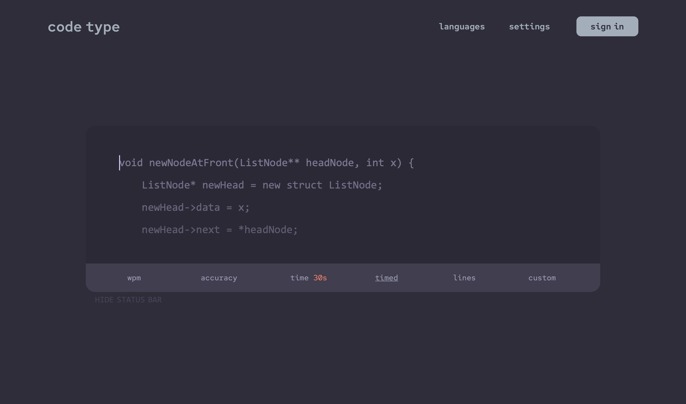
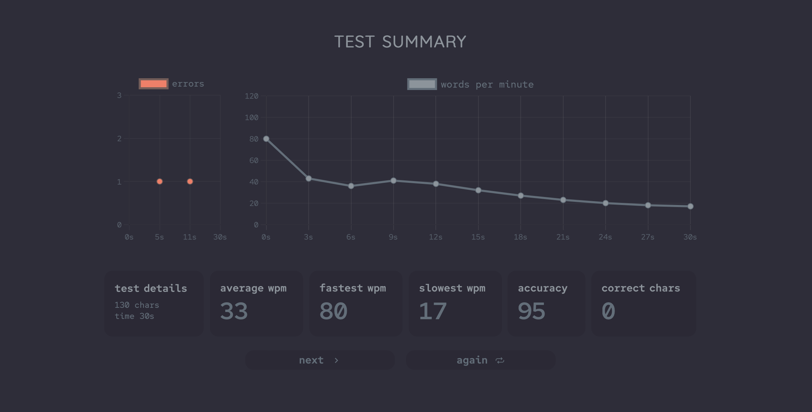
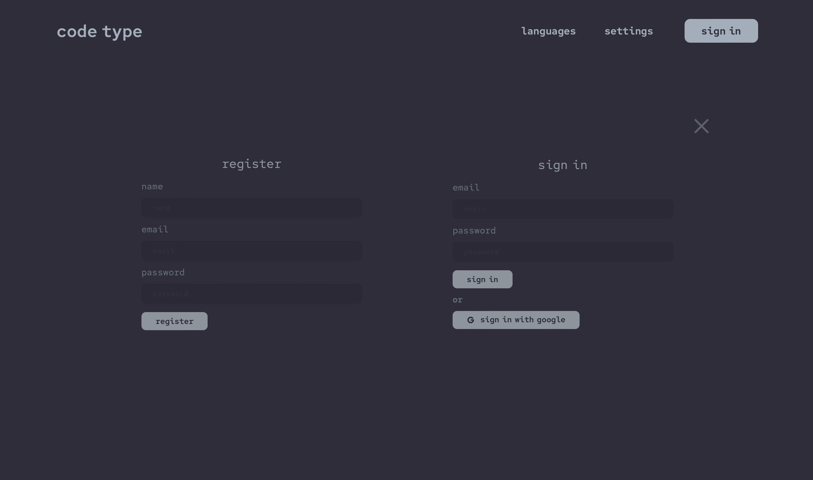

# Code Type

## About 

Code Type is a minimal and elegant application to allow users to get familiar and faster at typing code. It is currently in development and the website only supports pregenerated C++ code. 

The application will implement machine learning to generate code automatically and multiple languages will be supported for the user to choose from. 

The front-end uses React JS, TypeScript, CSS, and HTML. The routing and navigation is done through react-router-dom. 

The backend is currently a MySQL server for development however it will be transitioned to a MongoDB server. All get requests are through Node.js and Express JS. 

## Features 

* minimal design inspired by [monkeytype](https://monkeytype.com)
* test can be customized and have different limits
* test results are displayed through graph
* easy commands to start new test or restart previous test
* live wpm and accuracy on dynamic status bar 

## Features Coming Soon

* users can log in to save their settings
* customizable with more settings and themes 
* auto generating code and support for multiple programming languages 
* user can upload their own code

## Preview Images

Since the Code Type is not released yet, the following is a preview of the current progress. 

### Main Page 

This is the default view of the application. 

* It will support more themes and focus mode in the future. 

### Select Language  

This is the pop-up window for selecting the language. 

* There are many options present but for the time being, only C++ is supported. 
* Auto generated code and ML will enable support for multiple languages. 

### Practice Code 

This is a preview of the practice code section. 

* As you type, the display changes according to whether you typed the correct characters. 
* You can see the live wpm, accuracy, and the time remaining the status bar. 
* You can change the limit of the test to either time or the number of lines. 

### Test Results 

This is a preview of the test result display after the user completes a test. 

* This shows the words per minute and the accuracy across the test in a plot over time. 
* It also shows the errors in the test in a separate plot. 
* The average, best, and worst wpm are displayed. The final accuracy is also displayed.  

### Sign In Page 

This is a preview of the sign in or sign up page. The user can sign in to save their progress and settings.

* The user will be able to sign in with their email. 
* The user can also log in with google. 
* The users progress and settings will be saved. 

### Settings Page

This is a preview of the settings page where the user can change multiple options to their liking. 

* The user will be able to change test settings, status bar settings, and appearance settings. 
* There will be more settings and customization in the future. 

